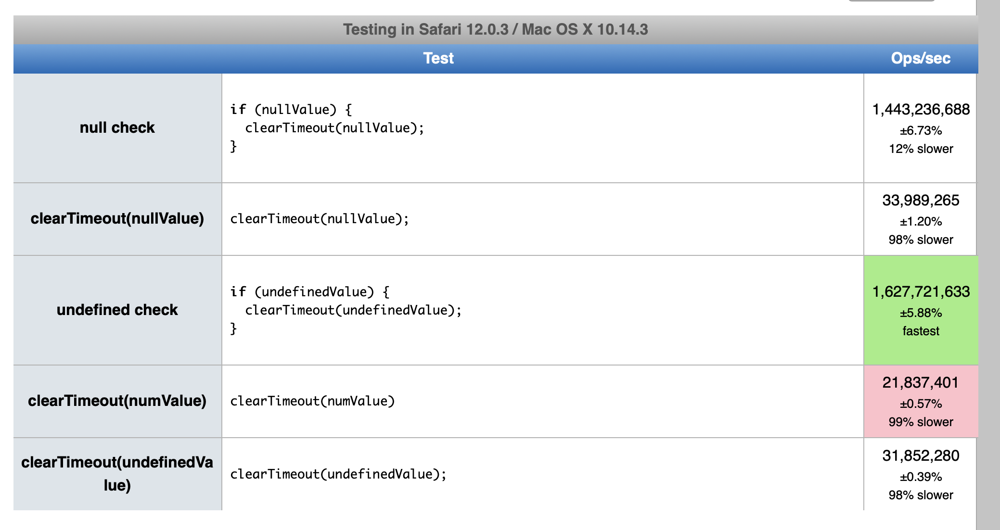

I have used `setTimeout` and `clearTimeout` lots of times for lots of reasons, and one pattern I see and have used myself often is:

```javascript

let timeoutId;

function someFunction () {
  // Do something cool
  timeoutId = null;
}

timeoutId = setTimeout(someFunction, 1000);

/*
 * Some code happens, who knows what, and
 * then we decide want to cancel our timeout
*/

if (timeoutId) {
  clearTimeout(timeoutId);
  timeoutId = null;
}
```

OK Cool that works no problem. You have a timeout, for some reason you no longer want it to fire, so you clear it. But the funny part is the

```javascript
if (timeoutId) {
```

The other day I was in a code review and was wondering if that check is even needed. Can you clear a timeout without bothering to check if it exists (or is a valid value)? Should you?

The TL;DR is: Yes you can, and it depends (😳).


### Can you clear a timeout without bothering to check if it exists?

Yep. `clearTimeout` [just no-ops](https://developer.mozilla.org/en-US/docs/Web/API/WindowOrWorkerGlobalScope/clearTimeout) if you pass in an identifier that doesn’t exist or is invalid.

### Should you?

I mean you’ll save yourself a few lines of code, and I don’t think having a check adds any readability to the code. So my first thought was: Yeah wtf why am I bothering to check? This is crazy. Just an extra logic operation right?

BUT then I thought I’d do some due diligence, and if performance is important because you’re calling `clearTimout` a LOT then you may want to think again. [calling clearTimout with an invalid value is slower than checking ahead of time yourself](https://jsperf.com/null-check-cleartimeout-vs-cleartimeout-null/8). It looks like this is true for all major browsers, but here’s a screenshot of the tests running in Safari 12.0.3:



How much does this matter? 🤷‍ if you’re calling `clearTimout` here and there in your code, chances are the difference is negligible. But if you have a giant web app where performance is critical and you are calling `clearTimeout` hundreds of times (I can’t even think of a use case for this but someone out there must be doing this right.) then you probably want to do everything you can to make performance speedy, which includes checking that the timeout ID is valid.

----

One thing I’m curious about is what is going on behind the scenes to make this performance worse. I did some googling but nothing came up so I guess most people haven’t noticed, don’t care, or else the answer is so obvious that no one has bothered to write about it 🙃 (or my google-fu is just exceptionally bad.)

----

🐰Here’s a fun easter egg: `setTimeout` and `setInterval` use the same pool of IDs for timeouts so you can actually call `clearInterval` on a timeout ID and vice versa and it will still work. But obviously this would be a ridiculously weird thing to do and is not advised.
